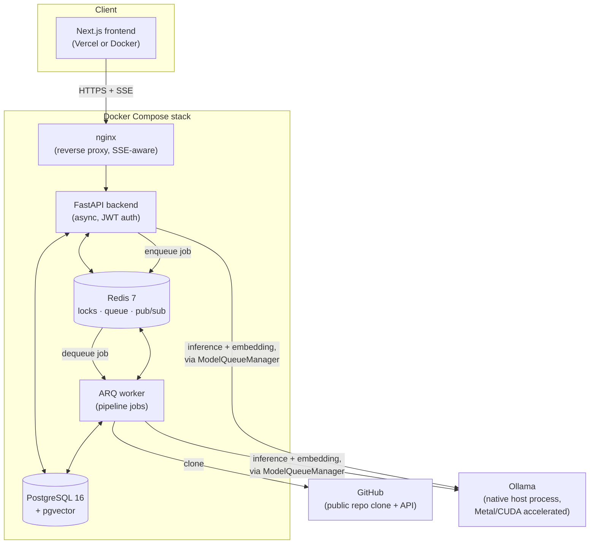
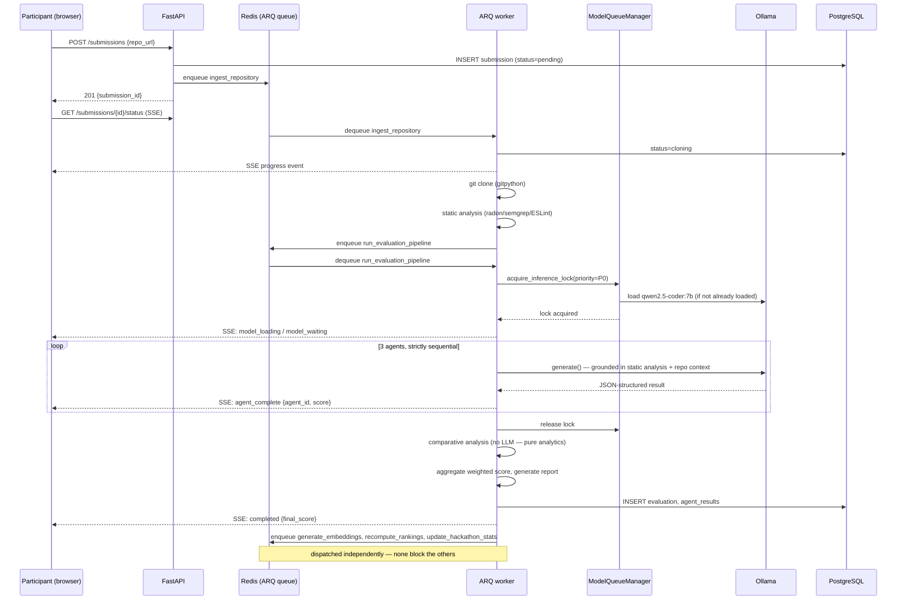
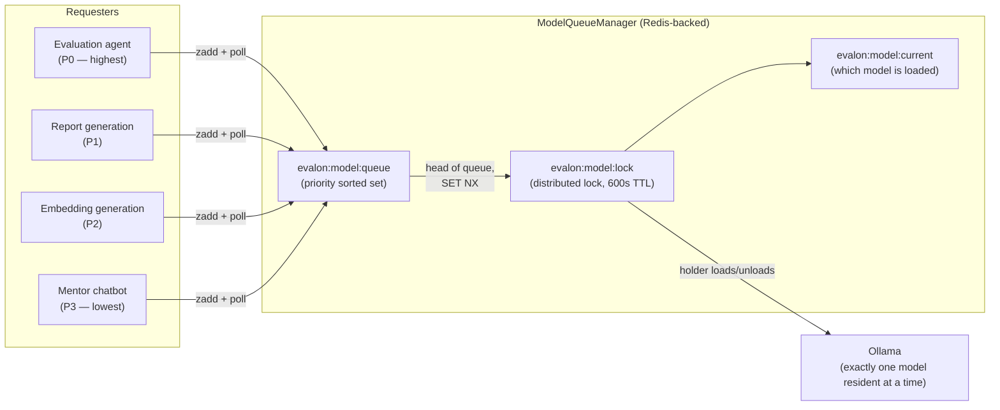
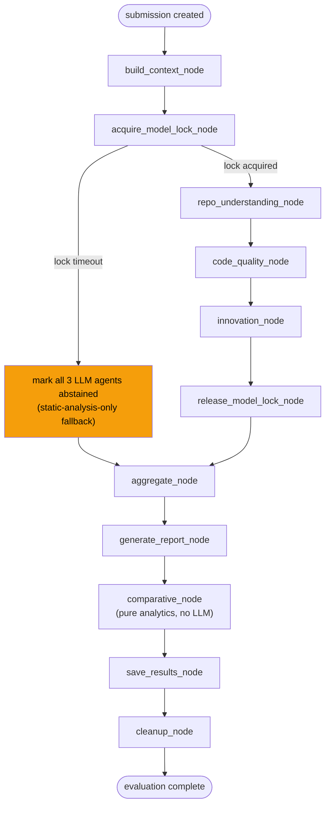

# EVALON Architecture

## System overview



The backend API process and the ARQ worker process are **separate
containers running the same codebase**. The API handles requests and
short reads; the worker runs the actual evaluation pipeline (cloning,
static analysis, the LLM agents) as background jobs, so a slow evaluation
never blocks the HTTP request/response cycle. Both talk to Ollama through
the same `ModelQueueManager` — the Redis lock it holds is what keeps them
from ever loading two models into the one Ollama process at once,
regardless of which process (or how many worker replicas) is asking.

## Component interaction: submitting and evaluating a repo



The three dispatched follow-up jobs at the bottom are a deliberate
deviation from the spec's literal linear chain (documented in
`docs/reports/PHASE-5-REPORT.md` and `PHASE-6-REPORT.md`): rankings and
dashboard stats must never wait on embedding generation, since embeddings
are a "nice to have" for the mentor chatbot, not something the leaderboard
should ever be blocked by.

## The model queue: EVALON's central constraint



This is the single most important piece of infrastructure in the system
(spec's own words) — see `docs/decisions/ADR-006-model-resource-management.md`
for the full rationale. A consumer machine with 16–24GB of unified memory
cannot hold both `qwen2.5-coder:7b` and `nomic-embed-text` resident
simultaneously without risking OOM, so exactly one model is ever loaded,
access is strictly serialized via a Redis distributed lock, and every
requester types itself with a priority (P0 highest, P3 lowest) so an
active evaluation always wins a race against an idle participant asking
the mentor a question.

## Evaluation pipeline: the sequential LangGraph



Every node is independently fault-tolerant by construction (spec P3: one
failure never crashes the pipeline) — a plain sequential edge chain is
sufficient because each node catches its own failure modes and degrades
rather than raising. `cleanup_node` always runs last, deleting the cloned
repository from disk (spec: never store participant code permanently) —
this is why the embedding pipeline (Phase 6) captures everything it needs
from the in-memory `RepoContext` *before* this point, caching it in Redis
for the separately-dispatched `generate_embeddings` job to pick up.

## Database schema

```mermaid
erDiagram
    users ||--o{ hackathons : "creates (admin_id)"
    users ||--o{ hackathon_participants : "joins"
    users ||--o{ submissions : "submits"
    users ||--o{ chat_sessions : "owns"
    hackathons ||--o{ hackathon_participants : has
    hackathons ||--o{ criteria : defines
    hackathons ||--o{ submissions : receives
    hackathons ||--o{ evaluations : scopes
    hackathons ||--o{ rankings : scopes
    hackathons ||--|| hackathon_stats : "aggregates into"
    submissions ||--|| evaluations : "produces (1:1)"
    submissions ||--o{ rankings : "ranked as"
    submissions ||--o{ chat_sessions : "mentor for"
    submissions ||--o{ repo_embeddings : "chunked into"
    evaluations ||--o{ agent_results : "detailed by"
    criteria ||--o{ agent_results : "scored against"
    chat_sessions ||--o{ chat_messages : contains

    users {
        uuid id PK
        varchar email UK
        varchar hashed_password
        enum role "admin | participant"
    }
    hackathons {
        uuid id PK
        uuid admin_id FK
        enum status "draft|active|evaluating|finalized"
        jsonb settings
    }
    criteria {
        uuid id PK
        uuid hackathon_id FK
        decimal weight "sums to 1.0 per hackathon"
        varchar agent_id "nullable — maps to an agent"
    }
    submissions {
        uuid id PK
        uuid hackathon_id FK
        uuid user_id FK
        enum status "pending..completed|failed"
        boolean degraded
    }
    evaluations {
        uuid id PK
        uuid submission_id FK UK "1:1 with submission"
        enum status "pending|running|completed|failed|degraded"
        decimal final_score
        jsonb report "full structured scorecard"
    }
    agent_results {
        uuid id PK
        uuid evaluation_id FK
        uuid criterion_id FK "nullable"
        varchar agent_id
        boolean abstained
    }
    rankings {
        uuid id PK
        uuid hackathon_id FK
        uuid submission_id FK
        int rank
        boolean finalized "immutable once true"
    }
    hackathon_stats {
        uuid hackathon_id PK "1:1 with hackathon"
        jsonb score_distribution
        jsonb tech_stack_frequency
    }
    chat_sessions {
        uuid id PK
        uuid user_id FK
        uuid submission_id FK
    }
    chat_messages {
        uuid id PK
        uuid session_id FK
        enum role "user | assistant"
        jsonb retrieved_chunks
    }
    repo_embeddings {
        uuid id PK
        uuid submission_id FK
        vector embedding "768-dim, HNSW indexed"
        varchar chunk_type
    }
```

Every table has a UUID primary key and UTC timestamps, enforced at the
`Base`/mixin level (`app/models/base.py`) rather than per-table, so no
column individually opts out. The one HNSW index (on
`repo_embeddings.embedding`, cosine ops) is the only vector index in the
system — retrieval for the mentor chatbot is the only cosine-similarity
query anywhere.

## Key design patterns

- **Tool-then-AI grounding, everywhere.** No agent is ever asked "how good
  is this code?" in the abstract — `context_builder.py` assembles static
  analysis output (complexity findings, security findings, doc coverage)
  *into* the prompt first, and every agent's structured output includes
  `evidence` items that trace back to specific static analysis facts, not
  free-form LLM claims.
- **Degrade, never crash.** Three separate levels of this, all
  independently implemented: a single static analysis tool failing
  (semgrep timeout) degrades that tool's contribution; a single LLM agent
  failing (timeout, malformed JSON, model unavailable) degrades that
  agent to "abstained, static-analysis-only"; a hackathon-wide event (no
  submissions to compare against yet) degrades the comparative agent to
  `sufficient_data=false` rather than a divide-by-zero.
- **Redis as a coordination layer, not just a cache.** Three genuinely
  different uses in the same Redis instance: a distributed lock (model
  queue), an async job queue (ARQ), and a pub/sub + list hybrid for SSE
  (progress events are `RPUSH`'d with a TTL *and* `PUBLISH`'d, so a client
  that connects after some events already fired still sees full history,
  while a live-connected client gets real-time delivery without polling).
- **Idempotent finalization.** Once any `Ranking` row for a hackathon is
  marked `finalized=true`, `recompute_rankings_for_hackathon` becomes a
  no-op for that hackathon — a late-arriving retry job can never reshuffle
  a leaderboard that's already been shown to participants.
- **Fetch-based SSE, not `EventSource`.** Every SSE endpoint in EVALON
  requires a Bearer token (JWT), which the browser's native `EventSource`
  API cannot send. The frontend instead reads `fetch()`'s `ReadableStream`
  and hand-parses `data: ...\n\n` frames (`frontend/src/lib/sse.ts`).

## Data flow narrative

A submission's life: **pending** (row created) → **cloning** (gitpython,
size/file-count/timeout limits enforced) → **analyzing** (file tree,
language detection, tech stack extraction, then radon/semgrep/ESLint in
parallel *within* the static-analysis stage — the "never in parallel"
constraint applies to LLM agents specifically, not to independent
non-LLM tools) → **evaluating** (the LangGraph above) → **completed**
(or **degraded**, a sub-state of completed with a non-null score, or
**failed**, only when literally nothing — not even static analysis —
could produce a score).

In parallel with the evaluation, every new submission and every
completed evaluation triggers `update_hackathon_stats`, which
recomputes the admin dashboard's aggregate view and pushes it out over
the 15-second SSE dashboard stream — so an admin watching a live
hackathon never has to refresh.

After an evaluation completes, `generate_embeddings` chunks the
captured repo context (README, up to 5 representative code samples, a
repo summary, an evaluation summary, and a static-analysis findings
summary) and embeds each chunk via `nomic-embed-text`, storing them in
`repo_embeddings`. This is what makes the mentor chatbot's RAG context
possible — without it, `check_availability()` reports the mentor as "being
prepared," not broken.

## Technology choice justifications

Full comparative writeups are in [`RESEARCH.md`](RESEARCH.md); the short
version of *why*, not just *what*:

- **FastAPI** — async-native, so a slow Ollama call in one agent doesn't
  block the event loop from serving other requests (dashboard SSE, other
  participants' status polling) concurrently.
- **PostgreSQL + pgvector** — one database for both relational data (users,
  hackathons, scores) and vector search (chat retrieval), avoiding a
  second infrastructure dependency (a standalone vector DB) for a single,
  low-QPS use case.
- **ARQ over Celery** — Redis-native, async-first, and the entire rest of
  the stack (locks, pub/sub, cache) already runs on Redis; Celery would
  add a second broker concept for no benefit at this scale.
- **LangGraph** — the sequential-node structure maps directly onto the
  spec's exact required pipeline stages, with explicit state passed
  between nodes rather than an implicit conversational loop (which is
  what CrewAI and similar frameworks are actually built for, and this
  pipeline is deliberately *not* a conversation).
- **Ollama over vLLM/API-only** — the entire premise is that this runs on
  a participant's or organizer's own hardware during a hackathon, with no
  per-token API cost and no dependency on an external provider being
  reachable; vLLM's throughput advantages matter at a scale (many
  concurrent GPUs) this system explicitly doesn't target (see
  ModelQueueManager — concurrency is deliberately 1, not something vLLM's
  batching would help).
